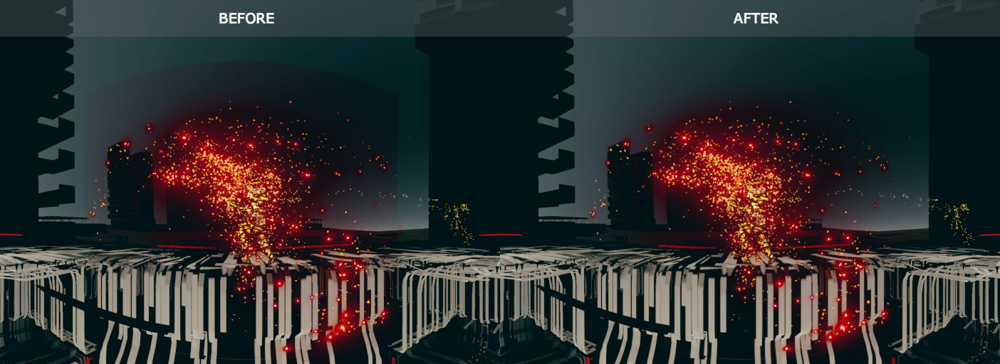
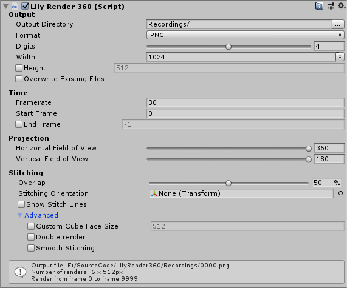
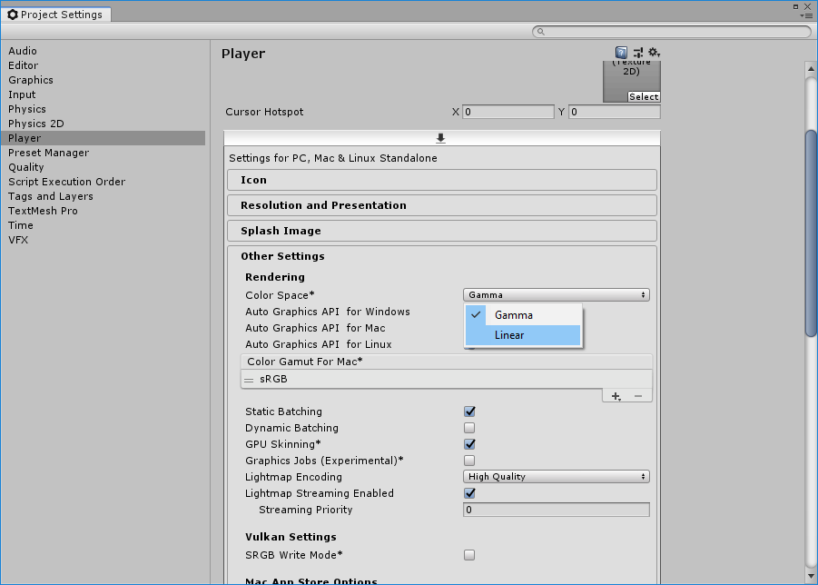

Lily Render 360
===============

Lily Render 360 is a tool for rendering a Unity scene into [equirectangular](https://en.wikipedia.org/wiki/Equirectangular_projection) images (also known as *geographic projection*). It has been written with precomputed rendering in mind, so it focuses on image quality rather than rendering speed. Nevertheless, efforts have been made to make it efficient where it did not mean sacrificing quality.

*Left-hand side shows a regular cube-based 360 rendering. Right-hand side has been rendered using Lily Render 360.*

Download
--------

A unity package is available for download on Gumroad: [LilyRender360-v1.1.0.unitypackage](https://gum.co/kMcSf). If you use this tool for a commercial purpose, please consider supporting it financially.

Features
--------

Unity features a basic 360 render functionality, available through the C# functions [`Camera.RenderToCubemap`](https://docs.unity3d.com/ScriptReference/Camera.RenderToCubemap.html) and [`RenderTexture.ConvertToEquirect`](https://docs.unity3d.com/ScriptReference/RenderTexture.ConvertToEquirect.html). But this has limitations, in particular:

 - There is no way to rotate the camera. It only renders along the Z axis.
 - Stitching lines appear, especially when using non local post effects like strong bloom.

Furthermore, as with rectangular rendering, one has to ensure that the `Time.deltaTime` is constant.

**Lily Render 360** provides a solution to all the aforementioned issues and even more:

 - Custom camera orientation. Lily Render 360 uses the orientation of the camera it is attached to. Whether you need to rotate a 360 video or play the hell with motion sickness, this is a must have.
 - Custom stitch lines orientation. If you need to place the stitch lines while maintaining the camera orientation; or if you want the camera to turn while the stitch lines remain in place, you can orient the stitch lines using a reference object.
 - Smooth stitch lines. Lily Render 360 provides several tools to minimize stitching artifacts. It can render an extra margin around each face of the cubemap and then smoothly merge the overlap region. Or it can render two cubemaps with different orientations and merge them.
 - Render in sRGB (Gamma) or HDR Linear color spaces.

Support
-------

Support is available through the [github issues](https://github.com/eliemichel/LilyRender360/issues) of this repository, as well as on the [support thread](https://forum.unity.com/threads/lily-render-360-stitch-free-equirectangular-rendering.637171/) on Unity forum.

I am available for development of **on-demand features**. Depending on the nature of the project for which you need it, I may or may not do it for free.

Example
-------

Here a test of different render settings on a sample scene with a *lot* of bloom.

First of all, here is what it would look like using regular Unity rendering, or Lily Render 360 with an overlap rate of 0%:

This clearly illustrates the stitching problem. In particular, one can notice that the bloom effect jumps from one face of the cube to another one when a particle crosses the face boundaries. So let's use the overlap parameter. Here is an example at 10%, meaning that the size of each face is increased by 10%:

This starts to fade out the artifacts, and would work for more subtle effects, but with so much bloom, we must increase it. Here is a result at 50%:

There is still a darker area around the edges, but it is hardly noticeable. And with 100% it is clean:

Not that we could increase by more than 100% in theory, but when going too high in overlap, the price gets higher and the gain gets smaller and smaller, so it is not worth it.

This is an example of moving stitching lines. This uses the debug feature of Lily Render 360 that displays the cubemap faces boundaries in the render:

With a 50% overlap:

Usage
-----

The **Lily Render 360** tool is a component to attach to a Camera:

Here is a description of its parameters:

**Output Directory**  
Absolute path, or path relative to the project root. If it does not end with a slash, the last part is used as filename prefix.

**Digits**  
Number of digits in the output file name. This limits the maximum number of frames.

**Format**  
File format used for output. PNG files are 8 bit sRGB. EXR are 32 bit Linear.

**Width**  
Width of the output frames.

**Height**  
Height of the output frames. If disabled, a suggested height is auto-computed from the width and field of view parameters. It is recommanded to keep it disabled and tune the *Vertical Field of View* instead.

**Overwrite Existing Files**  
If the output file already exists, overwrite it or not. If not, the frame is not rendered and a warning is logged in the console.

**Framerate**  
Number of frames per second in the target render. If the game cannot run at this frame rate, it will be slowed down, so that no frame is dropped.

**Start Frame**  
Start rendering from this frame on. Frame numbers start at zero.

**End Frame**  
Stop the game once this frame has been rendered.

**Horizontal Field of View**  
Range of angles covered by the render on the horizontal axis. Use 360° for a full render, 180° for a half sphere, and so on.

**Vertical Field of View**  
Range of angles covered by the render on the vertical axis. Use 180° for a full spherical render, and around 90° to get more of a cylindrical effect.

**Overlap**  
Increase this to smooth the stitching. Render faces with a wider FoV, so that they overlap, to account for non local post-effects. This is expressed in percentage of the face size.

**Stitching Orientation**  
By default, the intermediate cube of renders is aligned to the camera axes. If this transform is specified, its local axes will be used instead. You may  may not want to parent this transform to the camera.

**Show Stitch Lines**  
Use this for debug, to visualize where cube faces boundaries are.

**Custom Cube Face Size**  
Size in pixels of the intermediate textures rendered in each of the six directions. Auto-computed given output width and stitching overlap. You may want  snap this value to a power of two for more efficiency.

**Double render**  
Render the cubemap twice, with a rotation of the stitching lines, then merge them to minimize stitch lines artifacts. Does not gain so much compared to creasing the overlap.

**Smooth Stitching**  
Merge the faces where they overlap, to minimize stitch lines artifacts. This must be used in conjunction with Overlap.

Tips and Tricks
---------------

### Rotating a 360 video

You can use this script to rotate an existing equirectangular video, using the workflow described [here](https://docs.unity3d.com/Manual/VideoPanoramic.html), to use the video as background, then rendering with Lily Render 360 on a rotated camera.

### Rendering in HDR

To render in HDR (High Dynamic Range) images, you must use the EXR format in the output settings of Unity. But you must also ensure that the Unity player is set to use an HDR rendering pipeline. This is ensured by switching the color space option to `Linear` in the project settings:

Known Limitations
-----------------

Report bugs if you find some! Whether it is an explicit error or something that looks suspicious in the renders.

Add different overlap fusion modes. When merging overlapping faces, simple average is used (with variable weights to smooth out the transition). But for some effects, other fusion mode could be useful. In particular, for bloom effect, a more appropriate fusion mode would be a max ("lighten" fusion mode).

This is more a technical concern than an issue, and does not affect the users, but I would have liked to use 3D render textures instead of lists textures for the faces, but I could not get it to work in Unity. If anybody passes by and have experience with those, help wanted!

License
-------

Lily Render 360 is released under the terms of the MIT License:

	Copyright (c) 2019 Élie Michel

	Permission is hereby granted, free of charge, to any person obtaining a copy
	of this software and associated documentation files (the "Software"), to
	deal in the Software without restriction, including without limitation the
	rights to use, copy, modify, merge, publish, distribute, sublicense, and/or
	sell copies of the Software, and to permit persons to whom the Software is
	furnished to do so, subject to the following conditions:
	The above copyright notice and this permission notice shall be included in
	all copies or substantial portions of the Software.

	THE SOFTWARE IS PROVIDED "AS IS", WITHOUT WARRANTY OF ANY KIND, EXPRESS OR
	IMPLIED, INCLUDING BUT NOT LIMITED TO THE WARRANTIES OF MERCHANTABILITY,
	FITNESS FOR A PARTICULAR PURPOSE AND NONINFRINGEMENT. IN NO EVENT SHALL THE
	AUTHORS OR COPYRIGHT HOLDERS BE LIABLE FOR ANY CLAIM, DAMAGES OR OTHER
	LIABILITY, WHETHER IN AN ACTION OF CONTRACT, TORT OR OTHERWISE, ARISING
	FROM, OUT OF OR IN CONNECTION WITH THE SOFTWARE OR THE USE OR OTHER DEALINGS
	IN THE SOFTWARE.
